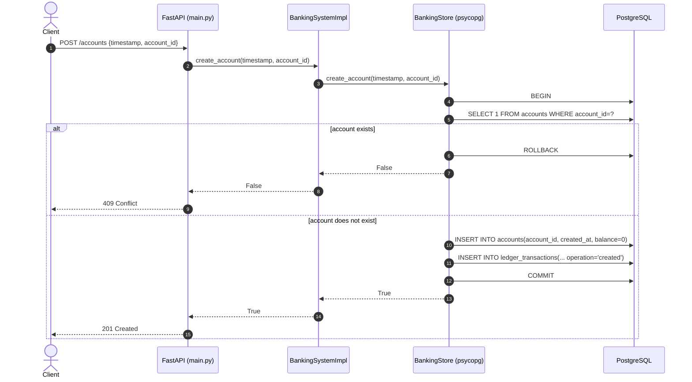
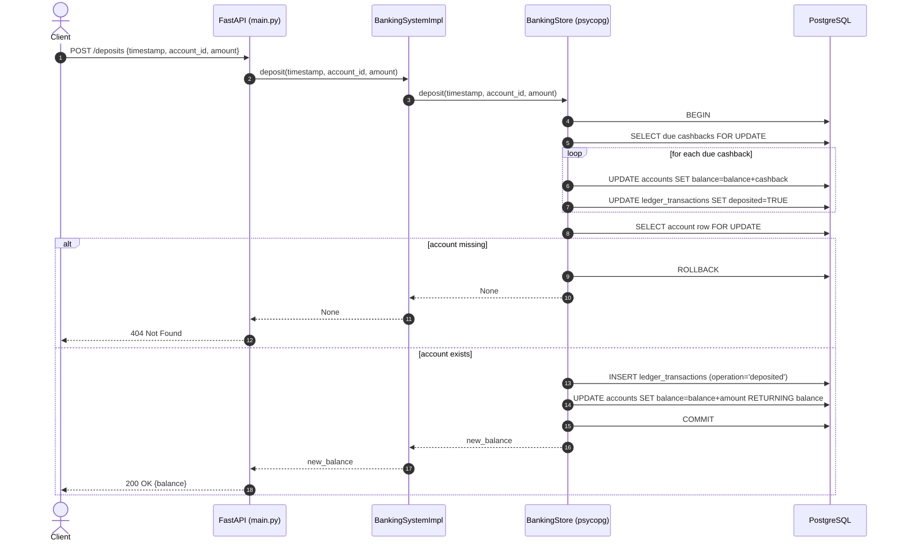
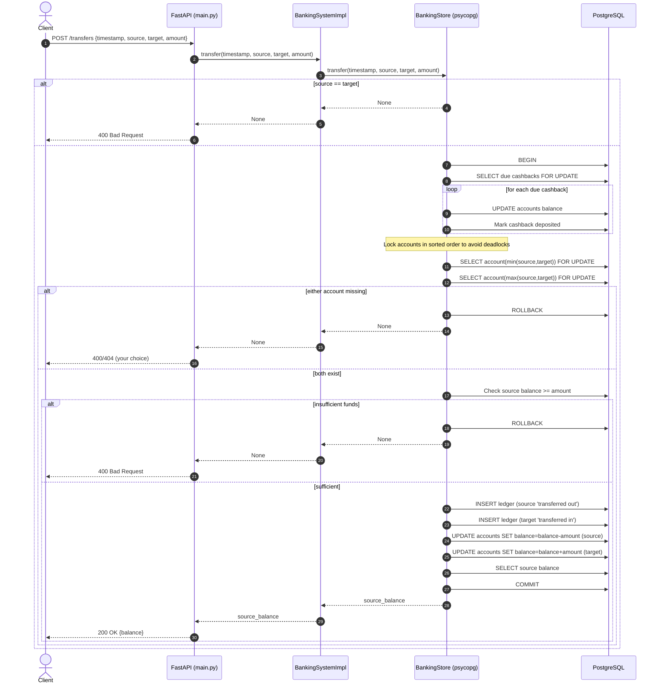
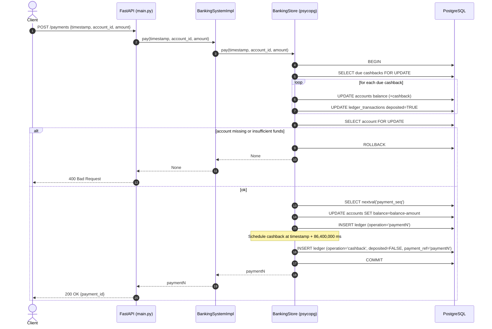
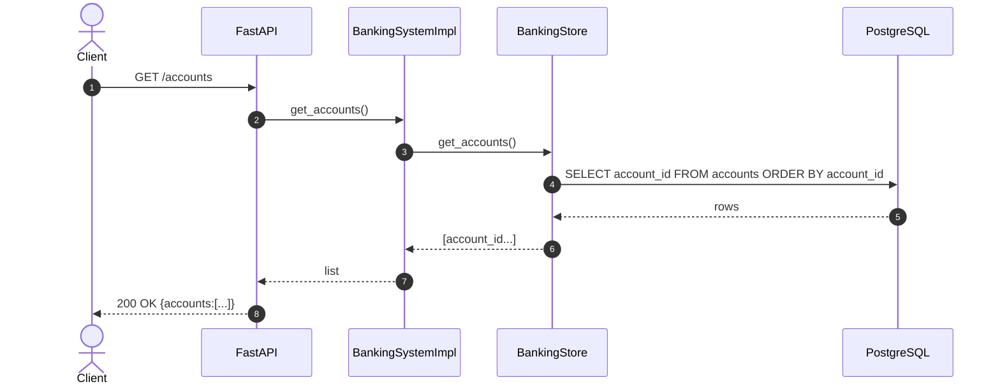
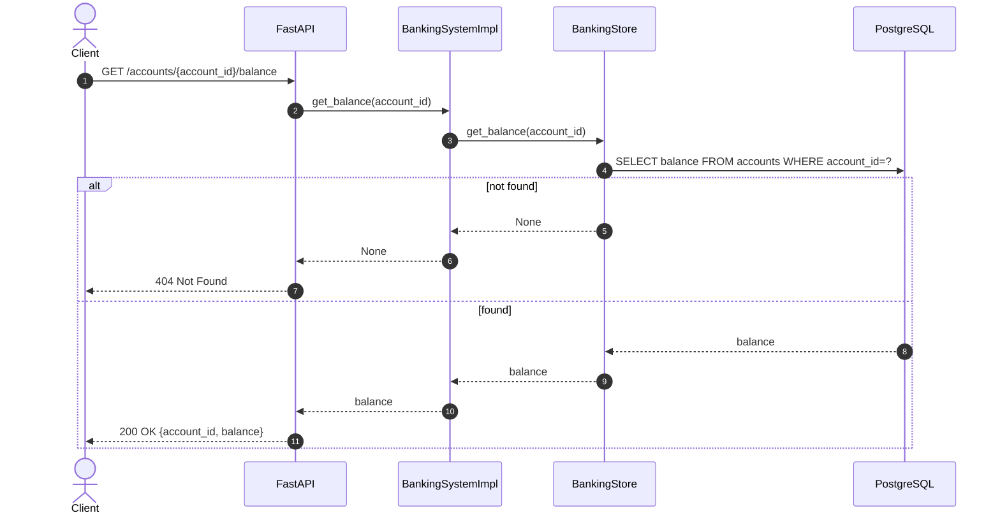

# POST endpoints
## Create account (POST / accounts)

## Deposit (POST / deposits)

## Transfer (POST / transfers)

## Pay (POST / payments)

# GET endpoints
## Get accounts (GET / accounts)

## Get balance (GET / accounts / {id} / balance)

